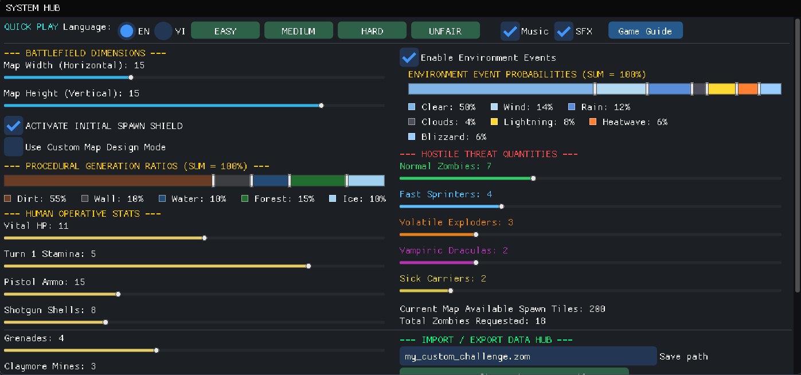
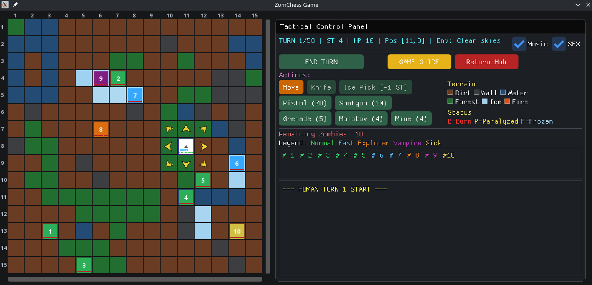

# 🧟 ZomChess: A Light 2D Turn-Based Tactical Game

---

## 📖 Language | Ngôn Ngữ
- [English](#-english-version)
- [Tiếng Việt](#-phiên-bản-tiếng-việt)

---

# 🇬🇧 English Version

## 🌌 Battle Context

Post-apocalypse. You are the sole surviving operative trapped and surrounded in a complex terrain infested with mutated entities. No retreat, no reinforcements. The only thing standing between you and death is limited ammunition, a sharp mind, and the ability to calculate every move on the battlefield with precision.

---

## 🎯 Ultimate Objective

* **Survive or Annihilate:** Clear all Zombies from the map before the turn limit (`turn_limit`).
* **Defeat Condition:** Your character runs out of health (`HP <= 0`) or fails to complete the mission within the allotted turns.

---

## 🎮 Turn-Based Gameplay Mechanics

The battlefield operates on a clear three-phase alternating system:

### 1. Human Turn Phase
Each turn, you receive a random amount of stamina (`Stamina`). You can perform the following actions as long as you have enough stamina:
* **Movement:** Move to any of 8 adjacent tiles. Moving through Dirt, Forest, Ice, Fire costs 1 Stamina, wading through Water costs 2 Stamina. Cannot move through Walls.
* **Attack & Weapon Usage:** Choose the weapons or tool to attack Zombies or to help yourself when being frozen.

### 2. Zombie Animation Phase
After you end your turn, all Zombies start hunting for you. They can feel where you are by your smelling. Once approaching, they can scratch or bite you.

### 3. Environment Phase
Environment is neither on your side or Zombies' side. It just does what it wants, but it can change the situation.

---

## ⚔️ Arsenal & Combat Capabilities

Your character is heavily armed but resources are extremely limited:

* **🔪 Knife:** Close-range melee weapon, no ammo cost but requires dangerous proximity.
* **⛏️ Ice Pick:** Use to break Ice tile where you stand, make that tile into Water.
* **🔫 Pistol:** Standard ranged weapon with stable accuracy.
* **💥 Shotgun:** Wide-area damage dealing at close range.
* **💣 Grenade:** Throw to a location, detonates after a delay (Grenade Timer) causing area damage.
* **🪔 Molotov:** Throw to a location, may create Fire tile (or not).
* **🛑 Mines:** Place traps on any tile. Zombies stepping on them trigger instant detonation.

---

## ☣️ Mutated Zombie Types

Each Zombie type has different health (`HP`) and movement mechanics to counter your tactics:

* **Normal Zombie:** Basic enemy, moves 1 tile per turn.
* **Fast Sprinter:** Ultra-fast movement of 2 tiles per turn, specializes in surprise attacks.
* **Volatile Exploder:** Explosive zombie. When defeated or triggered, they self-destruct causing area damage.
* **Vampiric Dracula:** Blood-sucking creature. Each successful attack on the player restores their health.
* **Sick Carrier:** Spread sick by biting, making you lose turns and stamina point .

---

## 🌟 Standout Features

* **⚡ Quick Play:** Provides 4 pre-programmed difficulty levels suitable for all skill levels: **Easy**, **Medium**, **Hard** and **Unfair**.
* **🛠️ Visual Map Editor:** Allows you to manually draw terrain and set player spawn positions directly on the graphical interface.
* **📥 Challenge File Sharing System (.zom):** Export/Import functionality lets you easily save custom maps or load maps from friends to challenge yourself. Share `.zom` files with the community and challenge other players!
* **🛡️ Smart Spawn Shield:** Optional 5x5 safe zone around your character at game start, preventing unfair Zombie spawns too close.
* **🖥️ Cyberpunk Combat Interface:** Dark color scheme combined with Live Radar Logs displaying real-time battlefield events (damage, explosions, zombie healing...) creating an intense atmosphere.

---

## 📑 Terrain Reference Guide

| Terrain Type | Display Color | Combat Properties |
| :--- | :--- | :--- |
| **Dirt** | Brown | Normal movement. Costs 1 Stamina. |
| **Water** | Blue | Swampy terrain slows movement. Costs 2 Stamina to traverse. Conduct electricity. |
| **Wall** | Black | Solid walls forming boundaries or structures, completely blocks movement. |
| **Forest** | Green | Flamable and spread Fire. |
| **Fire** | Red | Temporary, cause Burned status and damage. |
| **Ice** | White | May cause sliding. Conduct electricity. |

---

## 🎮 Screenshots





---

## 🚀 Building & Running

### Quick Start (Linux)
Pre-built executable for Linux (and maybe MacOS) is available in the [GitHub Releases](https://github.com/Luanium/ZomChess/releases). Simply download and run:
```bash
./ZomChess
```

### Build from Source

**Requirements:**
- CMake 3.10+
- C++20 compatible compiler
- SFML 2.5+
- ImGui + ImGui-SFML

**Linux:**
```bash
mkdir build && cd build
cmake ..
make
./ZomChess
```

**Windows (MSVC):**
```bash
mkdir build && cd build
cmake .. -G "Visual Studio 16 2019"
cmake --build . --config Release
.\Release\ZomChess.exe
```

**macOS:**
```bash
mkdir build && cd build
cmake ..
make
./ZomChess
```

---

## 🛠️ Technology Stack

* **Language:** C++20.
* **Frameworks:**
    * **SFML (Simple and Fast Multimedia Library):** Manages window, renders 2D graphics, sprites, and game loop.
    * **Dear ImGui + ImGui-SFML:** Creates smooth character/zombie stat configuration sliders, control panels, and map editor interface.

---

## 🎵 Credits

### Soundtrack Attribution
* **Battle Theme: Impending Boom** [battle_theme.ogg](assets/music/battle_theme.ogg)
* **Victory Theme: Discovery Hit** [victory_theme.ogg](assets/music/victory_theme.ogg)
* **Defeat Theme: The Ice Giants** [defeat_theme.ogg](assets/music/defeat_theme.ogg)
* **Menu Theme: Ancient Rite** [menu_theme.ogg](assets/music/menu_theme.ogg)

All music tracks are sourced from [Incompetech](https://incompetech.com/music/), by Kevin MacLeod under CC BY 4.0 License.

---

## 📄 License

This project is licensed under the AGPL-v3.0 - see the [LICENSE](LICENSE) file for details.

---

# 🇻🇳 Phiên Bản Tiếng Việt

## 🌌 Bối Cảnh Trận Đánh

Hậu tận thế. Bạn là đặc nhiệm sống sót duy nhất bị vây hãm trong một khu vực địa hình phức tạp đầy rẫy thực thể biến dị. Không có đường lui, không có tiếp viện. Thứ duy nhất ngăn cách bạn và cái chết là lượng đạn dược giới hạn, cái đầu lạnh và khả năng tính toán chuẩn xác từng bước đi trên chiến trường.

---

## 🎯 Mục Tiêu Tối Thượng

* **Sống sót hoặc Tiêu diệt:** Quét sạch toàn bộ Zombie trên bản đồ trước khi hết lượt (`turn_limit`).
* **Điều kiện Thua cuộc:** Nhân vật cạn kiệt sinh lực (`HP <= 0`) hoặc không hoàn thành nhiệm vụ trong số lượt quy định.

---

## 🎮 Cơ Chế Gameplay Theo Lượt (Turn-Based)

Chiến trường hoạt động theo cơ chế ba pha luân phiên rõ ràng:

### 1. Pha của Con Người (Human Turn)
Mỗi lượt, bạn sẽ nhận được một lượng thể lực ngẫu nhiên (`Stamina`). Bạn có thể thực hiện các hành động sau miễn là còn đủ Stamina:
* **Di chuyển:** Đi tới 8 ô xung quanh. Đi qua nền Đất (`Dirt`) tốn 1 Stamina, lội qua Nước (`Water`) tốn 2 Stamina. Không thể đi vào Tường (`Wall`) hay Vật cản (`Obstacle`).
* **Tấn công & Sử dụng vũ khí:** Sử dụng vũ khí để tấn công Zombie hoặc tự thoát khỏi tình trạng đóng băng.

### 2. Pha của Zombie (Zombie Animating)
Sau khi bạn kết thúc lượt, các Zombie bắt đầu di chuyển về phía bạn. Chúng cảm nhận vị trí của bạn qua mùi. Một khi lại gần, chúng sẽ cắn hoặc cào bạn.

### 3. Pha của Môi trường
Môi trường không đừng về phe nào. Nó chỉ làm những gì nó muốn, nhưng có thể thay đổi tình thế trên chiến trường.

---

## ⚔️ Kho Vũ Khí & Khả Năng Tác Chiến

Nhân vật được trang bị tận răng nhưng tài nguyên vô cùng hữu hạn:

* **🔪 Dao găm (Knife):** Vũ khí cận chiến tầm gần, không tốn đạn nhưng đòi hỏi áp sát nguy hiểm.
* **⛏️ Ice Pick:** Dùng để phá ô Băng và biến ô Băng thành ô Nước.
* **🔫 Súng lục (Pistol):** Vũ khí tầm xa tiêu chuẩn, độ chính xác ổn định.
* **💥 Súng săn (Shotgun):** Sức sát thương diện rộng hủy diệt ở cự ly gần.
* **💣 Lựu đạn (Grenade):** Ném vào một vị trí, kích nổ sau một khoảng thời gian (Grenade Timer) gây sát thương lan rộng phá hủy mục tiêu.
* **🪔 Molotov:** Ném vào một vị trí, có thể tạo ra Lửa (hoặc không).
* **🛑 Mìn Claymore (Mines):** Đặt bẫy tại ô bất kỳ. Zombie dẫm phải sẽ kích hoạt nổ ngay lập tức.

---

## ☣️ Các Chủng Loại Zombie Biến Dị

Mỗi loại Zombie sở hữu chỉ số máu (`HP`) và cơ chế di chuyển khác nhau để khắc chế chiến thuật của bạn:

* **Zombie Thường:** Kẻ địch cơ bản, di chuyển 1 ô mỗi lượt.
* **Zombie Nhanh:** Di chuyển siêu tốc 2 ô mỗi lượt, chuyên áp sát bất ngờ.
* **Zombie Nổ:** Zombie phát nổ. Khi bị tiêu diệt hoặc kích hoạt, chúng tự bạo gây sát thương lan ra xung quanh.
* **Zombie Dơi:** Quái vật hút máu. Mỗi lần tấn công trúng con người, chúng sẽ được hồi phục sinh lực.
* **Zombie Bệnh:** Lan truyền mầm bệnh qua vết cắn, làm bạn giảm số lượt và mất thể lực.

---

## 🌟 Tính Năng Đặc Sắc Thu Hút Người Chơi

* **⚡ Trận Đấu Nhanh (Quick Play):** Cung cấp 3 mức độ khó lập trình sẵn phù hợp với mọi trình độ: **Binh nhì (Easy)**, **Trung tá (Medium)**, và **Ác mộng (Hard)**.
* **🛠️ Trình Biên Tập Bản Đồ Trực Quan (Visual Map Editor):** Cho phép bạn tự tay vẽ địa hình (Đất, Nước, Tường, Vật cản) và đặt vị trí xuất phát cho nhân vật ngay trên giao diện đồ họa.
* **📥 Hệ Thống Chia Sẻ Thử Thách (.zom):** Tính năng Xuất/Nhập dữ liệu (`export_challenge_file` / `import_challenge_file`) giúp bạn dễ dàng lưu lại map tự chế hoặc tải bản đồ từ bạn bè để thử thách bản thân. Chia sẻ file `.zom` với cộng đồng và thử thách những người chơi khác!
* **🛡️ Vùng Bảo Hiểm Thông Minh (Spawn Shield):** Tùy chọn kích hoạt vùng an toàn 7x7 quanh nhân vật khi bắt đầu game, ngăn chặn Zombie sinh ra quá gần gây bất công.
* **🖥️ Giao Diện Tác Chiến Cyberpunk:** Tông màu chủ đạo tối kết hợp bảng Live Radar Logs hiển thị thời gian thực mọi diễn biến trên chiến trường (sát thương, vụ nổ, zombie hồi máu...) tạo cảm giác nghẹt thở.

---

## 📑 Hướng Dẫn Tra Cứu Thông Tin Địa Hình

| Loại Địa Hình | Màu Sắc Hiển Thị | Đặc Tính Tác Chiến |
| :--- | :--- | :--- |
| **Dirt (Đất)** | Nâu Đất | Di chuyển bình thường. Tốn 1 Stamina. |
| **Water (Nước)** | Xanh Dương | Đầm lầy cản bước. Tốn tới 2 Stamina để vượt qua. Dẫn điện. |
| **Wall (Tường)** | Xám Khói | Tường kiên cố biên giới hoặc kiến trúc nội thất, chặn hoàn toàn di chuyển. |
| **Forest (Rừng)** | Green | Dễ cháy và lan truyền Lửa. |
| **Fire (Lửa)** | Red | Tạm thời, gây hiệu ứng cháy và mất máu. |
| **Ice (Băng)** | White | Có thể gây trượt. Dẫn điện. |

---

## 🎮 Ảnh Chụp Màn Hình


---

## 🚀 Cách Build & Chạy Game

### Khởi Động Nhanh (Linux)
File executable đã được build sẵn cho Linux (và có lẽ MacOS) có sẵn trong [GitHub Releases](https://github.com/Luanium/ZomChess/releases). Chỉ cần tải xuống và chạy:
```bash
./ZomChess
```

### Build từ Source

**Yêu cầu:**
- CMake 3.10+
- Trình biên dịch hỗ trợ C++20
- SFML 2.5+
- ImGui + ImGui-SFML

**Linux:**
```bash
mkdir build && cd build
cmake ..
make
./ZomChess
```

**Windows (MSVC):**
```bash
mkdir build && cd build
cmake .. -G "Visual Studio 16 2019"
cmake --build . --config Release
.\Release\ZomChess.exe
```

**macOS:**
```bash
mkdir build && cd build
cmake ..
make
./ZomChess
```

---

## �️ Công Nghệ Phát Triển

* **Ngôn Ngữ:** C++20.
* **Frameworks:**
    * **SFML (Simple and Fast Multimedia Library):** Quản lý cửa sổ, render đồ họa 2D, sprite và vòng lặp game.
    * **Dear ImGui + ImGui-SFML:** Tạo các slider cấu hình chỉ số nhân vật/zombie, bảng điều khiển và trình chỉnh sửa map editor mượt mà.

---

## 🎵 Ghi Công

### Ghi Công Nhạc Nền
* **Battle Theme: Impending Boom** [battle_theme.ogg](assets/music/battle_theme.ogg)
* **Victory Theme: Discovery Hit** [victory_theme.ogg](assets/music/victory_theme.ogg)
* **Defeat Theme: The Ice Giants** [defeat_theme.ogg](assets/music/defeat_theme.ogg)
* **Menu Theme: Ancient Rite** [menu_theme.ogg](assets/music/menu_theme.ogg)

Tất cả bản nhạc được lấy từ nguồn [Incompetech](https://incompetech.com/music/), đóng góp bởi Kevin MacLeod theo Giấy phép CC BY 4.0.

---

## 📄 Giấy Phép

Dự án này được cấp phép theo Giấy phép AGPL-v3.0 - xem tệp [LICENSE](LICENSE) để biết chi tiết.
