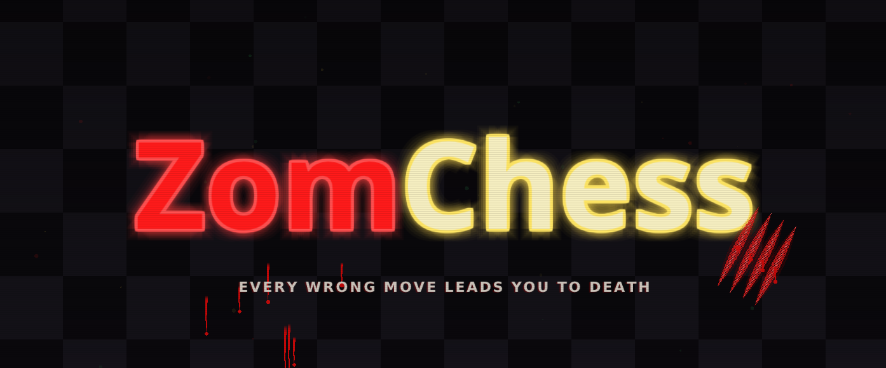
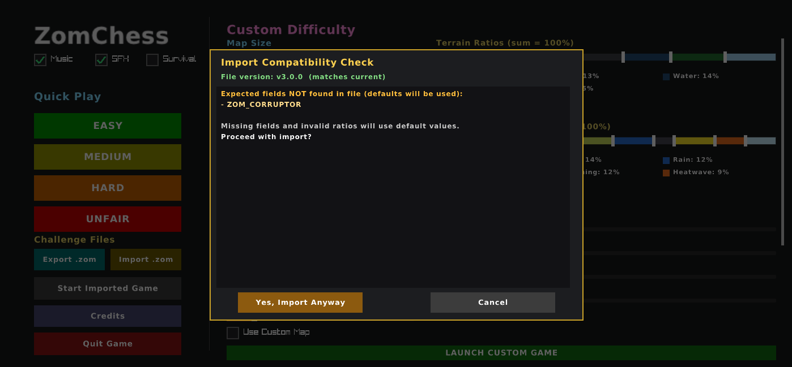
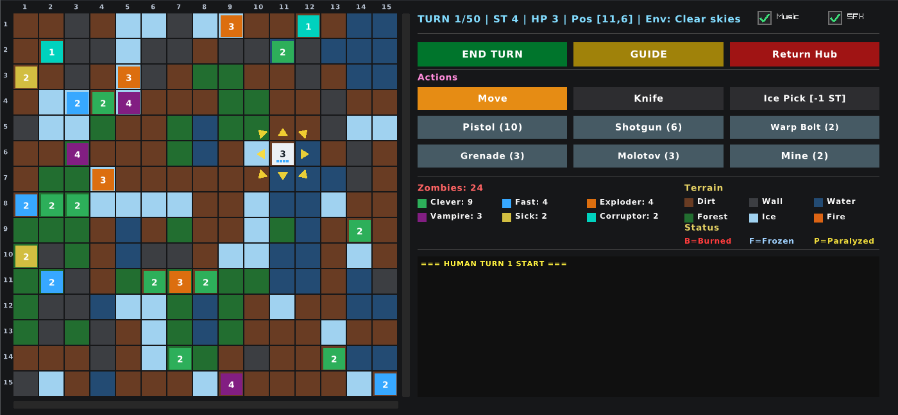

# 🧟 ZomChess: A Light 2D Turn-Based Tactical Game

---

## 📖 Language | Ngôn Ngữ
- [English](#-english-version)
- [Tiếng Việt](#-phiên-bản-tiếng-việt)

---

# 🇬🇧 English Version

* **🏪 Play immediately on itch.io platform:** Nothing to install. Play directly at [itch.io](https://luanium.itch.io/zomchess).

* **🌐 Download the web-based version [`ZomChess_web.zip`](https://github.com/Luanium/ZomChess/releases):** Run on all popular operating systems (Windows, Linux, MacOS), no internet required, only Python3 is needed.

* **🐧 Download the Linux executable version [`ZomChess`](https://github.com/Luanium/ZomChess/releases):** For Linux only, self-contained, nothing else needed.

## 🌌 Battle Context

Post-apocalypse. You are the sole surviving operative trapped and surrounded in a complex terrain infested with mutated entities. No retreat, no reinforcements. The only thing standing between you and death is limited ammunition, a sharp mind, and the ability to calculate every move on the battlefield with precision.

---

## 🎯 Ultimate Objective

* **Survive or Annihilate:** Clear all Zombies from the map before the turn limit.
* **Defeat Condition:** Your character runs out of health (`HP = 0`) or fails to complete the mission within the allotted turns.

---

## 🎮 Turn-Based Gameplay Mechanics

The battlefield operates on a clear three-phase alternating system:

### 1. Human Turn Phase
Each turn, you receive a random amount of stamina. You can perform actions as long as you have enough stamina: move across terrain, attack with weapons or tools, set traps, or end your turn deliberately. **There is no undo — plan before you act.**

### 2. Zombie Animation Phase
After you end your turn, all Zombies hunt for you. They sense your position and close in to scratch or bite.

### 3. Environment Phase
The environment is on nobody's side. Storms, blizzards, lightning, heatwaves, and darkness all play out on their own terms — and they will change the situation.

---

## ⚔️ Arsenal & Combat Capabilities

Your character is heavily armed but resources are extremely limited. Your arsenal includes close-range melee, standard and spread-shot firearms, thrown explosives, fire, traps, and a spatial tool that swaps two map tiles — including the one you're standing on, which means instant death if you aim wrong.

---

## ☣️ Mutated Zombie Types

Six distinct enemy archetypes, each demanding a different approach. Some are fast. Some explode on death. Some drain your HP to heal themselves. Some spread disease that costs you turns. Some pick up weapons from fallen bodies and turn them against you. Some multiply by corrupting the loot around them.

---

## 🌟 Standout Features

* **⚡ Quick Play:** Four pre-set difficulty levels — **Easy**, **Medium**, **Hard**, and **Unfair** — for instant action at any skill level.

* **🛠️ Visual Map Editor:** Draw terrain tile by tile, place zombie spawns, set the human starting position, and configure every match parameter through a fully graphical interface.

  

* **📥 Challenge File Sharing (.zom):** Export your custom map as a `.zom` file and send it to a friend. They import it, play the exact same scenario, and report back. Same map, same conditions — pure tactics decide who survives. Share with the community and see who can clear what you built.

  

* **📖 In-Game Guide:** A full reference guide is accessible at any time during play — no need to leave the game to look something up.

  

* **🛡️ Smart Spawn Shield:** Optional safe zone around your starting position to prevent unfair early-game zombie clustering.

* **🪖 Survival Mode:** Without any reinforcement or supply, how many waves of Zombies can you stand before falling?

---

## 🎮 Screenshots

---
## 🎵 Credits

### Soundtrack
All music by Kevin MacLeod ([Incompetech](https://incompetech.com/music/)), licensed under [CC BY 4.0](https://creativecommons.org/licenses/by/4.0/).

| Track | Title |
| :--- | :--- |
| Menu Theme | Ancient Rite |
| Battle Theme | Impending Boom |
| Victory Theme | Discovery Hit |
| Defeat Theme | The Ice Giants |

### Inspiration
The original idea traces back to my friend, Trần Thanh Sang, who played the on-paper version with me in our childhood. With the help of modern tools, I developed and digitalized the gameplay to recall part of those memories. That's the reason ZomChess exists.

---
## 📄 License

This project is licensed under the AGPL-v3.0 — see the [LICENSE](LICENSE) file for details.

---

# 🇻🇳 Phiên Bản Tiếng Việt

* **🏪 Chơi ngay trên nền tảng itch.io:** Không cần cài đặt. Chơi trực tiếp trên [itch.io](https://luanium.itch.io/zomchess).

* **🌐 Tải bản chạy trên trình duyệt [`ZomChess_web.zip`](https://github.com/Luanium/ZomChess/releases):** Chạy được trên các hệ điều hành phổ biến (Windows, Linux, MacOS), không cần internet, chỉ cần có Python3.

* **🐧 Tải bản Linux executable [`ZomChess`](https://github.com/Luanium/ZomChess/releases):** Thiết kế riêng cho Linux, không cần cài gì thêm.

## 🌌 Bối Cảnh Trận Đánh

Hậu tận thế. Bạn là đặc nhiệm sống sót duy nhất bị vây hãm trong một khu vực địa hình phức tạp đầy rẫy thực thể biến dị. Không có đường lui, không có tiếp viện. Thứ duy nhất ngăn cách bạn và cái chết là lượng đạn dược giới hạn, cái đầu lạnh và khả năng tính toán chuẩn xác từng bước đi trên chiến trường.

---

## 🎯 Mục Tiêu Tối Thượng

* **Sống sót hoặc Tiêu diệt:** Quét sạch toàn bộ Zombie trên bản đồ trước khi hết lượt.
* **Điều kiện Thua cuộc:** Nhân vật cạn kiệt sinh lực (`HP ≤ 0`) hoặc không hoàn thành nhiệm vụ trong số lượt quy định.

---

## 🎮 Cơ Chế Gameplay Theo Lượt

Chiến trường hoạt động theo cơ chế ba pha luân phiên rõ ràng:

### 1. Pha của Con Người
Mỗi lượt, bạn nhận được một lượng thể lực ngẫu nhiên. Bạn có thể di chuyển, tấn công, đặt bẫy, sử dụng công cụ — miễn là còn đủ Stamina. **Không có tính năng hoàn tác — hãy tính toán trước khi hành động.**

### 2. Pha của Zombie
Sau khi bạn kết thúc lượt, các Zombie bắt đầu di chuyển về phía bạn. Chúng cảm nhận vị trí của bạn và tiếp cận để cắn hoặc cào.

### 3. Pha của Môi Trường
Môi trường không đứng về phe nào. Bão, băng giá, sét, nắng hạn, bóng tối — tất cả diễn ra theo quy luật riêng và sẽ thay đổi tình thế chiến trường.

---

## ⚔️ Kho Vũ Khí & Khả Năng Tác Chiến

Nhân vật được trang bị tận răng nhưng tài nguyên vô cùng hữu hạn. Kho vũ khí bao gồm cận chiến, súng bắn thẳng và tản rộng, vũ khí ném, bẫy lửa, mìn và một công cụ hoán đổi hai ô bản đồ với nhau — kể cả ô bạn đang đứng, nghĩa là nếu ngắm sai là chết ngay lập tức.

---

## ☣️ Các Chủng Loại Zombie Biến Dị

Sáu loại kẻ địch với đặc điểm riêng biệt, mỗi loại đòi hỏi một cách tiếp cận khác nhau. Có loại di chuyển nhanh, có loại phát nổ khi chết, có loại hút máu bạn để hồi máu bản thân, có loại lây bệnh làm giảm số lượt của bạn, có loại nhặt vũ khí từ xác rơi và dùng lại chống bạn, có loại biến loot xung quanh thành thêm đồng loại.

---

## 🌟 Tính Năng Đặc Sắc

* **⚡ Trận Đấu Nhanh:** Bốn mức độ khó có sẵn — **Easy**, **Medium**, **Hard** và **Unfair** — để vào game ngay không cần cấu hình.

* **🛠️ Trình Biên Tập Bản Đồ Trực Quan:** Vẽ địa hình từng ô, đặt vị trí xuất hiện của Zombie, thiết lập điểm xuất phát của nhân vật và cấu hình toàn bộ thông số trận đấu qua giao diện đồ họa.

  

* **📥 Hệ Thống Chia Sẻ Thử Thách (.zom):** Xuất bản đồ tự chế thành file `.zom` và gửi cho bạn bè. Họ nhập vào, chơi đúng kịch bản bạn đã tạo, rồi so sánh kết quả. Cùng bản đồ, cùng điều kiện — thuần túy chiến thuật quyết định ai sống sót. Chia sẻ với cộng đồng để xem ai vượt được thứ bạn xây dựng.

  

* **📖 Hướng Dẫn Trong Game:** Tài liệu tham chiếu đầy đủ có thể truy cập bất kỳ lúc nào trong khi chơi — không cần thoát game để tra cứu.

  

* **🛡️ Vùng Bảo Hiểm:** Tùy chọn tạo vùng an toàn quanh vị trí xuất phát, ngăn Zombie sinh ra quá gần ngay từ đầu trận.

* **🪖 Chế độ Sinh tồn:** Bạn sẽ trụ được bao nhiêu màn liên tục trước khi ngã xuống nếu không được tiếp chữa trị và tiếp tế đạn dược?

---

## 🎮 Ảnh Chụp Màn Hình

---
## 🎵 Ghi Công

### Nhạc Nền
Tất cả bản nhạc của Kevin MacLeod ([Incompetech](https://incompetech.com/music/)), theo giấy phép [CC BY 4.0](https://creativecommons.org/licenses/by/4.0/).

| Track | Tên Bài |
| :--- | :--- |
| Menu Theme | Ancient Rite |
| Battle Theme | Impending Boom |
| Victory Theme | Discovery Hit |
| Defeat Theme | The Ice Giants |

### Ý Tưởng Game
Ý tưởng ban đầu xuất phát từ bạn tôi, Trần Thanh Sang, người đã cùng tôi chơi phiên bản trên giấy của trò này trong thời thơ ấu. Với sự hỗ trợ của các công cụ hiện đại, tôi đã phát triển và số hóa gameplay để ôn lại một phần ký ức đó. Đó là lý do ZomChess ra đời.

---

## 📄 Giấy Phép

Dự án này được cấp phép theo AGPL-v3.0 — xem tệp [LICENSE](LICENSE) để biết chi tiết.
